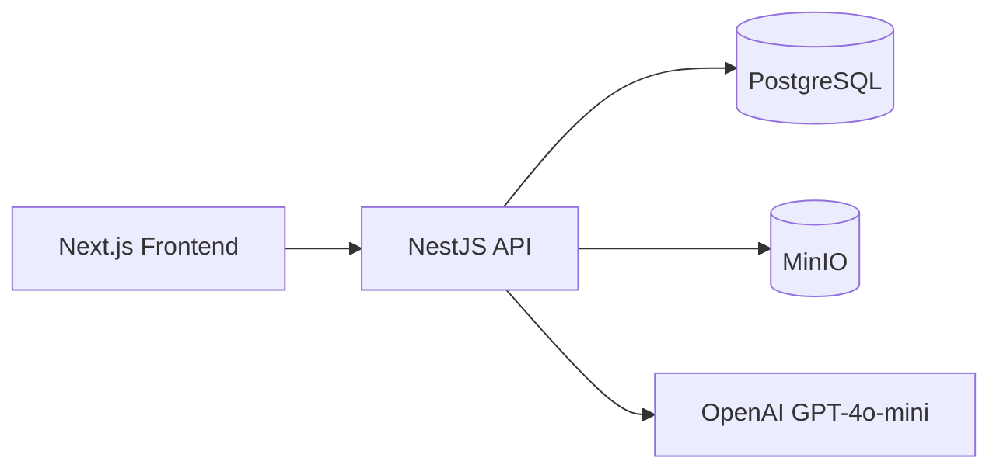

# Architecture

## System Diagram

## Layers

- Controller layer: HTTP routing, DTO validation, auth guards.
- Service layer: business logic, state transitions, ownership checks.
- Domain layer: pure state machine rules (`reports/state-machine.ts`).
- Persistence layer: Prisma ORM against PostgreSQL.

## Core Workflow

1. User signs up / logs in and receives JWT.
2. User creates report in DRAFT state.
3. User adds items in DRAFT/REJECTED only.
4. User uploads receipt; backend stores in MinIO and extracts fields via GPT-4o-mini.
5. User submits report (SUBMITTED).
6. Admin approves or rejects report.

## Why This Architecture

- Keeps state machine deterministic and testable.
- Avoids status mutations in controllers.
- Uses MinIO to stay cloud-compatible without cloud dependencies.
- Delivers required functionality within a one-day implementation window.
